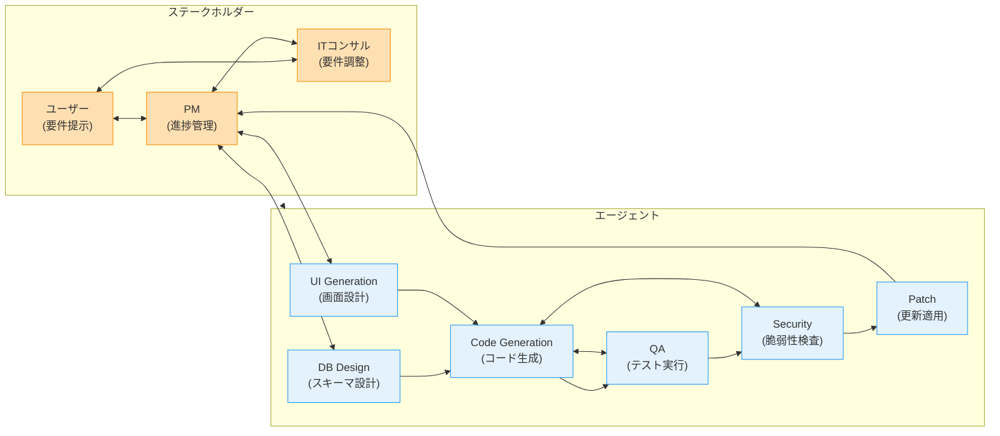

```mermaid
flowchart LR
  %% グラフ全体の方向を横に
  direction LR

  %% サブグラフを横並びにするためのダミーリンク
  Stakeholders -->| | Agents

  %% ステークホルダー定義（内部は縦並び）
  subgraph Stakeholders["ステークホルダー"]
    direction TB  %% 縦並びに変更
    U["ユーザー<br/>(要件提示)"]
    PM["PM<br/>(進捗管理)"]
    ITC["ITコンサル<br/>(要件調整)"]
  end

  %% エージェント定義（内部は横並び）
  subgraph Agents["エージェント"]
    direction LR
    DBD["DB Design<br/>(スキーマ設計)"]:::agent
    UI["UI Generation<br/>(画面設計)"]:::agent
    CODE["Code Generation<br/>(コード生成)"]:::agent
    QA["QA<br/>(テスト実行)"]:::agent
    SEC["Security<br/>(脆弱性検査)"]:::agent
    PATCH["Patch<br/>(更新適用)"]:::agent
  end

  %% フロー定義
  U <--> PM
  U <--> ITC
  PM <--> ITC
  PM <--> DBD & UI --> CODE --> QA --> SEC --> PATCH --> PM
  CODE <--> QA 
  CODE <--> SEC

  %% スタイル定義
  classDef agent fill:#e3f2fd,stroke:#2196f3,stroke-width:1px;
  classDef stakeholder fill:#ffe0b2,stroke:#fb8c00,stroke-width:1px;
  class U,PM,ITC stakeholder;

  %% ダミーリンクを透明にする
  linkStyle 0 stroke-width:0;

```